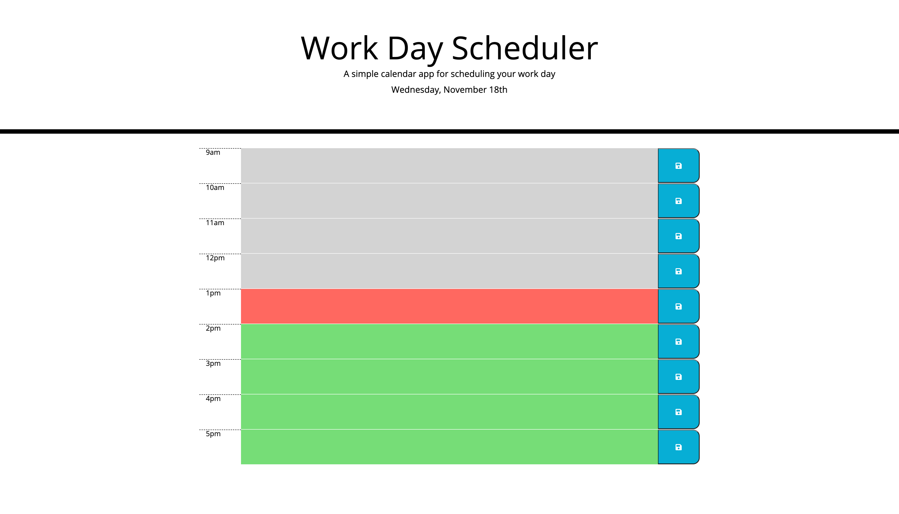

When the planner is opened, it displays the current day at the top. When you scroll down, you are presented with time blocks for the standard business day. Each time block is color coded to indicate if its in the past, present, or future. When you click a time block, you can enter in an event and save it to the local storage by clicking the, "Save" button.

The languages used for this project were HTML, CSS, and Javascript.

Page on initial load: 
Page on after user input: 

https://mbubel.github.io/day-planner/Develop/index.html
